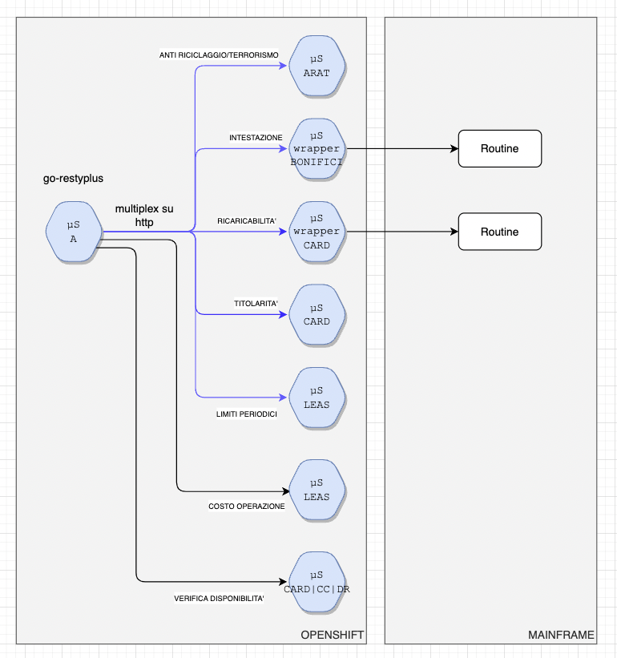
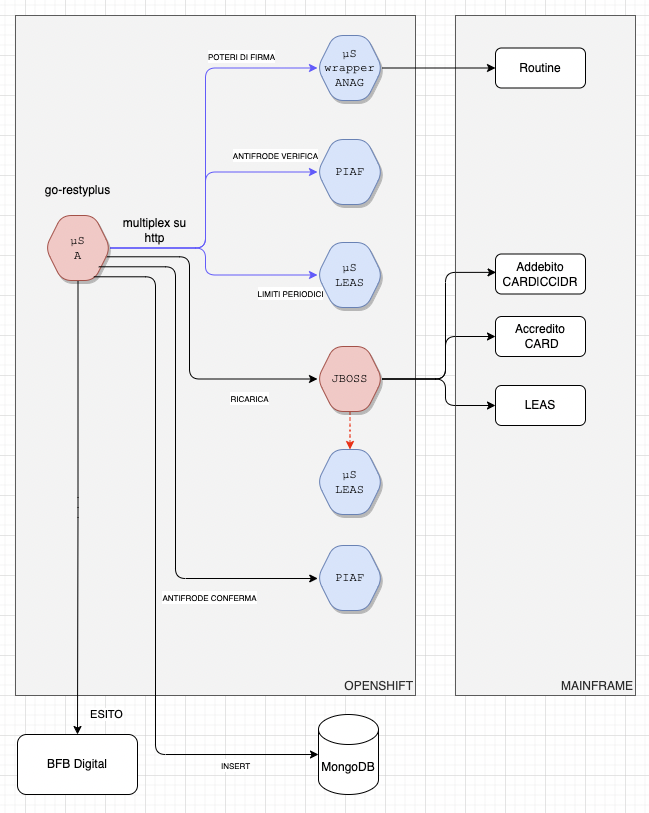
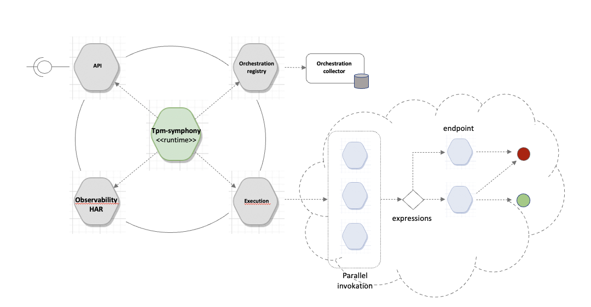

## TPM-Symphony

Obiettivo del progetto la realizzazione di un componente in grado di orchestrare le invocaioni a servizi Rest/Json ed esporre degli endpoint invocabili dall'esterno per l'attivazione di queste orchestrazioni.
Il progetto ha un obiettivo di genericità e non vuole essere legato ad uno specifico scenario ma soddisfare, entro certi limiti, un numero diverso di use-case.
Nella sua implementazione corrente ha l'obiettivo di coprire tutti i requisiti espressi in __come si chiama l'ambito attuale__ attraverso un approccio molto configurabile. Le esigenze espresse
prevedono la necessità di 

- invocare un certo numero di microservizi in serie ed in parallelo (per esigenze di latenza complessiva evidentemente)
- usare le response di alcuni per costruire le request dei successivi
- decidere le chiamate effettive e l'output in base ai parametri in ingresso e alle risposte ottenute.

Il diagramma successivo mostra, nell'ambito del contesto corrente, come il microservizio (a sx) debba invocare in  parallelo 5 microservizi e poi eseguire successivamente le invocazioni di due microservizi ulteriori.
Dalla figura, si evidenzia come alcuni di questi microservizi si appoggino su procedure mainframe e siano sostanzialmente dei wrapper.



In alcuni degli scenari in ambito sono previste delle operazioni __dispositive__. Dal punto di vista dell'orchestrazione nulla cambia in quanto, anche gli elementi dispositivi saranno __wrappati__ e quindi riconducibili 
all'interno di chiamate ad endpoint rest/json. Eventuali esigenze di transattività saranno gestite all'interno del singolo __wrapper__ come si chiarisce nella figura successiva nella quale un componente con
un JBoss containerizzato chiama tre procedure mainframe in modalità XA.



### Architettura



L'obiettivo del progetto è dunque quello di  mettere a disposizione un artefatto che possa adattarsi a use-case diversi dai processi in ambito mediante operazioni di configurazione.
Da un punto di vista generale, il componente permette di esporre endpoint a partire da una descrizione degli stessi e di __eseguire__ un grafo orientato aciclico nel quale:

- i nodi sono insiemi di endpoint da invocare (se piu' di uno nello stesso nodo, in parallelo)
- gli archi permettono di transire da un nodo al successivo. 

Gli archi uscenti da un nodo possono avere molteplicità superiore ad uno ma, in ogni caso, solamente uno sarà percorribile. Non sono previsti __parallel gateway__ ma la scelta di uno degli archi uscenti sarà
determinata da espressioni booleane calcolate sullo stato della esecuzione. Solo un arco potrà essere percorso.

La figura precedente mostra quattro sotto componenti principali

- Orchestration registry: questo componente si occupa di caricare la descrizione delle orchestrazioni a partire da una qualche forma di repository che viene 
acceduto da un crawler (es. cartelle messe a disposizione del microservizio piuttosto che repo git-hub).
- API: tra le varie informazioni configurate e disponibili nella registry si troverà anche la descrizione del/degli enpoint che debbono essere esposti tramite API.
- Execution: all'invocazione di uno degli endpoint esposti il componente provvederà ad attraversare il grafo che costituisce l'orchestrazione invocando i vari servizi censiti nelle informazioni di configurazione; l'esecuzione termina con un nodo foglia 
(senza piu' archi uscenti) e l'output verrà restituito in uscita.
- Observability: a parte le normali informazioni di metriche e tracce previste, il sistema loggerà anche l'esecuzione con un livello informativo simile a quello previsto per il formato [HAR](https://en.wikipedia.org/wiki/HAR_(file_format)).

### Esposizione end point

In corrispondenza di ogni singola orchestrazione viene esposto un end-point cui deve corrispondere una definizione per poter effettuare una validazione preliminare delle richieste stesse.
Il progetto prevede di utilizzare file in formato open-api per descrivere gli end-point da esporre con i relativi controlli di validazione e il loro collegamento con le orchestrazioni sottostanti.
Il/i file open-api sono previsti in formato open-api 3 e prevedono alcune __convenzioni__ per risultare validi. A titolo esemplificativo utilizziamo
l'esempio riportato in [Esempio BPAP Verifica](examples/ex-bpap-verifica/tpm-symphony-openapi.yml) corredandolo di alcuni brevi commenti.

Il file dichiara un endpoint rest in modalità POST all'url `/api/v1/verifica`.

#### servers[0].url
Nella sezione servers è importante la valorizzazione dell'url del primo elemento (si tratta di un array). Questo valore viene usualmente popolato con un riferimento poco utile come `http://localhost:8080`. Nel nostro caso 
deve essere popolato con il gruppo gin ([gin-gonic](https://github.com/gin-gonic/gin) è l'http server che espone l'endpoint) che si intende dichiarare. 
In generale, a parte utilizzi specifici, viene valorizzato con la stringa `app/v1`.

In conseguenza di questa scelta, i `paths` che si intendono esporre verranno privati del tipico prefisso coincidente con il gruppo scelto. In un documento open-api i paths sono relativi rispetto all'url del server.
Nel caso dell'esempio il risultato sarà di questo tipo (il path `/verifica` a run-time sar&agrave; `/api/v1/verifica`):

```
openapi: 3.0.1
info:
  title: BPAP Servizi Ricarica Orchestratore
  description: Orchestratore Servizi Ricarica PostePay v1.0
  version: '1.0'
servers:
  ## The url is the gin group of the orchestrations exposed by this file. It's a path type of url in the form /api/v1 and not a localhost type of reference
  - url: /api/v1
    description: Generated server url
paths:
  /verifica:
    post:
```

#### x-symphony
Ogni __path__ dichiarato nel file open-api deve essere __relazionato__ con l'id di una orchestrazione. Questa associazione viene eseguita utilizzando il meccanismo delle estensioni previste per open-api. 
Deve essere riportato la propriet&agrave; `x-symphony` che verrà riconosciuta e processata di conseguenza. Questa propriet&agrave; &egrave; un oggetto che permette di indicare l'id della orchestrazione di interesse.

```
paths:
  /verifica:
    post:
      ## Extension to indicate orchestration related infos.
      x-symphony:
        id: "spm-bpap-verifica"
      tags:
        - Verifica
      summary: VERIFICA
      operationId: verifica
```

Nel frammento (tratto dall'esempio che stiamo illustrando) riportato qui sopra al path `/verifica` viene associato l'id `spm-bpap-verifica` che e' l'id della orchestrazione associata all'end-point.

#### Validazione dell'input
L'utilizzo dello standard open-api permette di definire in maniera condivisa le caratteristiche dell'endpoint esposto ma anche di eseguire le validazioni sull'input sulla base dei vincoli 
presenti nel documento (es. obbligatoriet&agrave; di elementi e parametri, ...).
I file in formato open-api vengono processati utilizzando la libraria [kin-openapi](https://github.com/getkin/kin-openapi) che fornisce un supporto piuttosto esteso del formato.
A __runtime__ i parametri della richiesta verranno validati dalla libreria e

- in caso di validazione positiva il sistema proceder&agrave; con l'esecuzione della orchestrazione
- in caso negativo verr&agrave; ritornato un codice di errore 400 (Bad Request) con un body strutturato come indicato nella appropriata sezione examples del path di interesse (nel nostro esempi `/verifica`).

```
 '400':
   description: BadRequest/Validation Error
   content:
     application/json:
       schema:
         $ref: '#/components/schemas/ErrorResponse'
       ## The example section has the purpose in case of validation errors, to produce a templated response.
       ## This response can  be in the examples.response.value or in the examples.response.externalValue referred file.encoding:
       ## It can be done either way with some implications on the nature
       examples:
         response:
           externalValue: "responseValidationError.tmpl"
           value:
             ambit: "validation"
             message: "errore di validazione"
             timestamp": "2022-03-28T12:55:03+02:00"
```

Al fallimento della validazione, il software ricercherà la sezione `"400"."content"."application/json"."examples"."response"` e valuter&agrave; le proprietà `value` e `extarnalValue` 
con la seconda che ha priorit&agrave; sulla prima. L'`externalValue` riporta il riferimento di un file (in generale) esterno che contiene il corpo di un template  la cui esecuzione
produrr&agrave; l'output di interesse. Nel nostro caso il template verr&agrave; eseguito con due variabili di stato:

- message: il valore effettivo dell'errore di validazione riscontrato
- ts: il timestamp formattato RFC3339 con il timestamp corrrente.

Stabilito quindi il meccanismo di validazione e di restituzione dell'errore, rimane da chiarire dove il sistema trova il file `responseValidationError.tmpl` e più in generale
dove trova il file open-api che descrive l'input.

### Crawler
